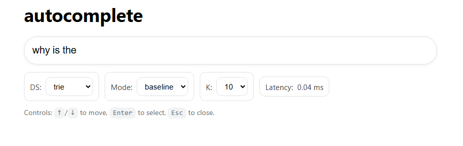
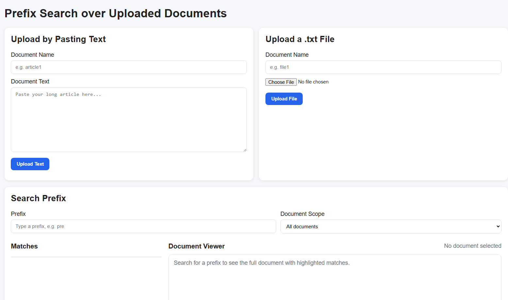
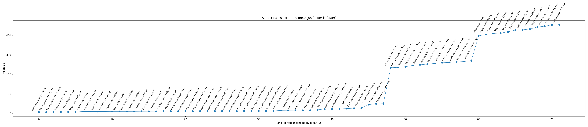
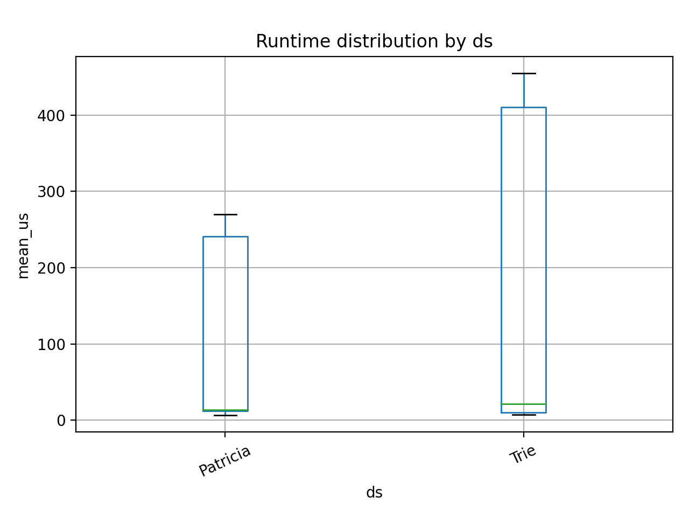
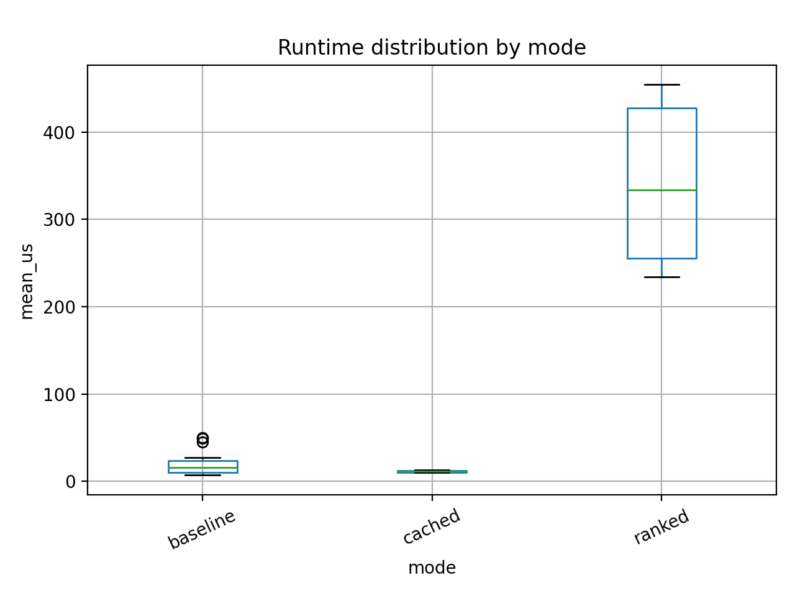
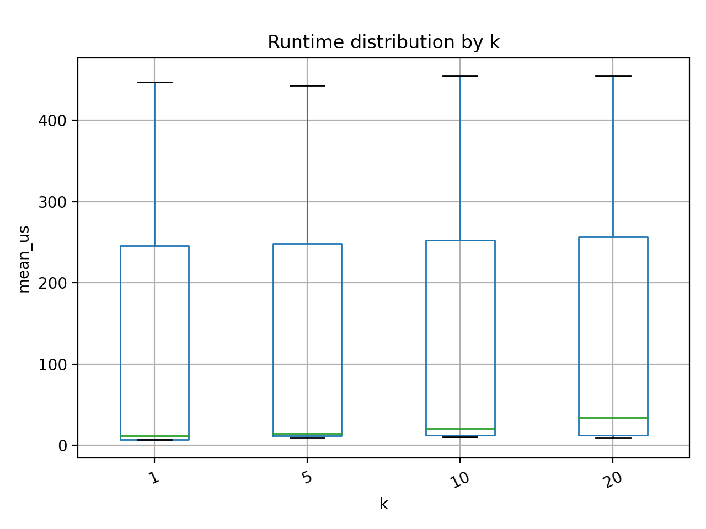
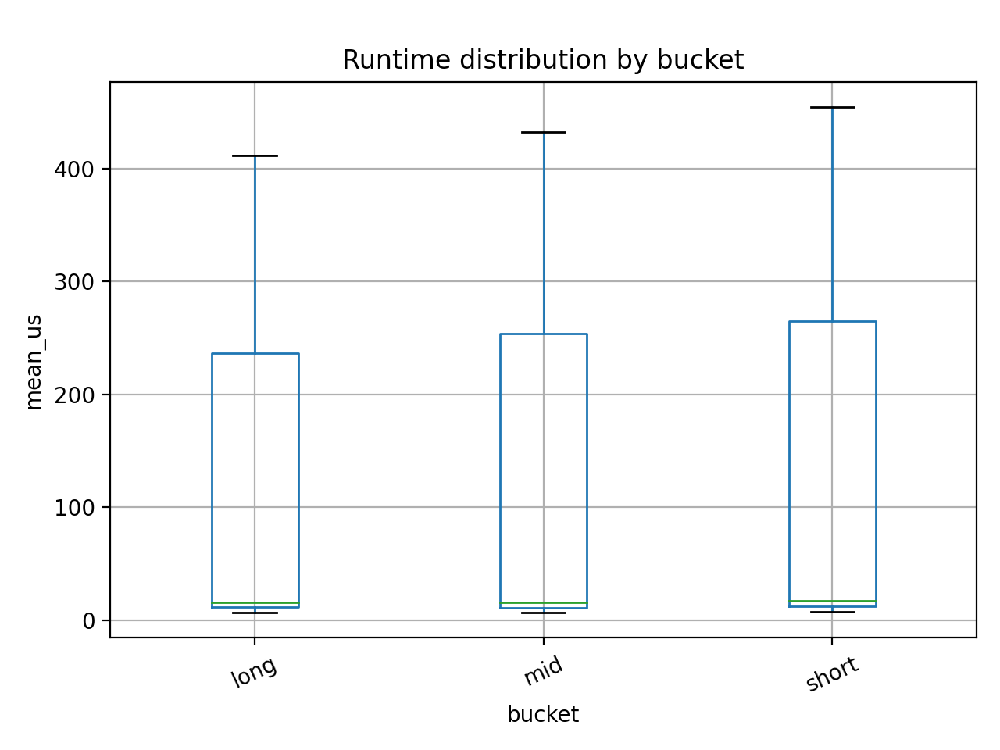
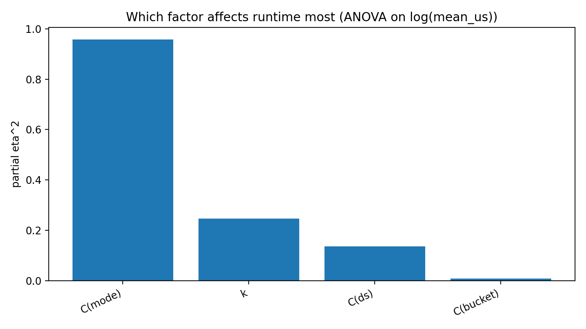

# SC4079 Final Year Project

## Trie and Patricia Trie for Autocomplete and Prefix Search

This project implements and evaluates two string indexing structures — a standard Trie and a Patricia Trie — for autocomplete and prefix-based retrieval. The system supports multiple suggestion strategies, including baseline prefix completion, frequency/recency-aware ranking, and cached top-k retrieval for lower query latency. A lightweight Flask web application is included to demonstrate the autocomplete engine and a simple document search module.

The project was developed as a Final Year Project to study how different trie-based representations affect correctness, memory usage, build cost, and query-time performance under realistic autocomplete workloads.

---

## Project Overview

Autocomplete is widely used in search engines, e-commerce systems, and productivity tools to reduce typing effort and improve retrieval speed. Tries are a natural fit for prefix search, while Patricia Tries compress single-child paths to reduce structural overhead. This project compares both approaches in a practical Python implementation and investigates how additional optimizations affect performance.

The prototype includes:

- Trie implementation for exact search, prefix search, and autocomplete
- Patricia Trie implementation for compressed prefix indexing
- Ranking mode using query frequency and recency-style event data
- Cached top-k mode to reduce repeated lookup cost
- Document indexing and keyword search
- Flask-based frontend for interactive testing
- Benchmark scripts and visualisations for evaluation

---

## Key Features

### 1. Autocomplete Engine
Supports multiple retrieval modes:
- Baseline: returns completions from prefix traversal
- Ranked: orders suggestions using usage statistics
- Cached: stores top suggestions at prefix nodes for faster lookup

### 2. Two Data Structures
- Trie: standard character-by-character prefix tree
- Patricia Trie: compressed trie with edge-label compaction

### 3. Document Search Module
- Indexes uploaded or predefined documents
- Supports searching for keywords inside documents
- Designed as a lightweight extension of the trie-based retrieval workflow

### 4. Evaluation and Benchmarking
Measures and compares:
- mean query latency
- runtime distribution
- factor impact across structure, mode, query bucket, and top-k
- correctness through combined automated test cases

---

## Tech Stack

- Python
- Flask
- Matplotlib
- Pandas
- NumPy
- Statsmodels

---

## Repository Structure

```text
SC4079-FINAL-YEAR-PROJECT/
│
├── app.py                         # Flask application entry point
├── engine.py                      # Autocomplete engine logic
├── trie.py                        # Standard Trie implementation
├── patricia.py                    # Patricia Trie implementation
├── document_index.py              # Document indexing and prefix search
├── .gitignore                     # Git ignore rules
│
├── test_all.py                    # Combined functional test cases
├── test_document_index.py         # Document search test cases
├── run_testcases.py               # Benchmark and testcase runner
│
├── query_generator.py             # Query generation script
├── generate_events.py             # Event generation for recency/frequency data
├── plot_results.py                # Plot generation and statistical analysis
│
├── phrases.txt                    # Input phrase dataset
├── queries.txt                    # Query set
├── queries_generated.txt          # Generated queries for experiments
├── query_log.csv                  # Query log for ranking experiments
├── events_rle.csv                 # Aggregated event log for ranked/cached modes
│
├── all_cases_sorted_mean_us.png   # Overall latency comparison
├── boxplot_bucket_mean_us.png     # Latency by query bucket
├── boxplot_ds_mean_us.png         # Latency by data structure
├── boxplot_k_mean_us.png          # Latency by top-k setting
├── boxplot_mode_mean_us.png       # Latency by retrieval mode
├── factor_impact_partial_eta2.png # Effect size summary plot
│
├── prototype_autocomplete.png     # Screenshot of autocomplete interface
├── prototype_doc_search.png       # Screenshot of document search interface
│
└── templates/                     # HTML templates for the Flask frontend
    ├── index.html                 # Main autocomplete page
    └── doc_search.html            # Document search page

```
> **Note:** Some files shown in the project structure may not appear in the repository if they are excluded by `.gitignore`. This is especially applicable to generated outputs, temporary files, caches, or local environment-specific files.
---

## How to Run

### 1. Install dependencies
```bash
pip install flask pandas numpy matplotlib statsmodels
```

### Optional. Prepare synthetic data (otherwise there is no data in web application)
```bash
python query_generator.py
python generate_events.py
```

### 2. Run the web application
```bash
python app.py
```

After the server starts, open one of these routes in your browser:

- `http://127.0.0.1:5000/` for the autocomplete interface
- `http://127.0.0.1:5000/doc-search` for the document search interface


Then open the local Flask URL shown in the terminal.

### 3. Run correctness tests
```bash
python test_all.py
python test_document_index.py
```

### 4. Run benchmark experiments
```bash
python run_testcases.py
```

### 5. Generate plots
```bash
python plot_results.py
```

---

## Prototype Workflow

The web prototype provides two main interfaces: an autocomplete page for interactive prefix suggestion, and a document search page for prefix matching over uploaded text files.

### 1. Autocomplete interface (`/`)

1. Run the Flask application with `python app.py`
2. Open `http://127.0.0.1:5000/`
3. Select the data structure (Trie or Patricia Trie)
4. Choose the retrieval mode (baseline, ranked, or cached) and set the top-\(K\) value
5. Type a prefix such as `why is the`
6. Observe the returned suggestions and measured query latency



### 2. Document search interface (`/doc-search`)

1. Open `http://127.0.0.1:5000/doc-search`
2. Upload a document either by pasting text or by submitting a `.txt` file
3. Provide a document name and select the desired document scope
4. Enter a prefix in the search field
5. Review the matching results and inspect the document viewer with highlighted matches



These two interfaces demonstrate the practical behaviour of the system before running the benchmark scripts and analysing the generated plots.

---

## Evaluation Summary

Key benchmark findings from the project are summarised below:

- Patricia Trie reduced build time from **38.547 s** to **25.420 s**.
- Peak memory usage decreased from **28.09 MB** (Trie) to **9.172 MB** (Patricia Trie).
- Node count decreased from **78,692** to **18,975**.
- Edge count decreased from **78,691** to **18,974**.
- Cached top-K storage decreased from **97,292** to **34,967** entries.

Average query runtime trends:

- By data structure:
  - Trie: **154.02 μs**
  - Patricia Trie: **93.09 μs**

- By mode:
  - Cached: **11.14 μs**
  - Baseline: **19.35 μs**
  - Ranked: **340.18 μs**

- By K:
  - K = 1: **117.66 μs**
  - K = 5: **121.12 μs**
  - K = 10: **124.86 μs**
  - K = 20: **130.60 μs**

Overall, the evaluation showed that autocomplete mode had the strongest effect on runtime, followed by K, while Patricia Trie provided the best overall balance of speed and compactness.
### Benchmark Visualisations

#### Overall comparison


#### Latency by data structure


#### Latency by retrieval mode


#### Latency by top-k value


#### Latency by query bucket


#### Factor impact / effect size


---

## Research Focus

This project investigates the following questions:

- How does a Patricia Trie compare with a standard Trie for autocomplete?
- What is the performance impact of ranking and cached top-k retrieval?
- How do different query lengths and top-k settings affect latency?
- Can trie-based indexing also support a simple document search workflow in the same prototype?

---

## Notes

- The benchmark images in this README assume the PNG files remain in the repository root.
- Ranked and cached modes depend on the generated/query log event data.
- The system is intended as a lightweight experimental prototype, not a production search engine.

---

## Future Improvements

Possible extensions include:

- larger real-world query logs
- fuzzy matching / typo tolerance
- memory profiling across larger datasets
- incremental online learning of ranking signals
- support for more advanced trie variants such as ART or burst tries

---

## Author

Jonathan Lee
SC4079 Final Year Project

